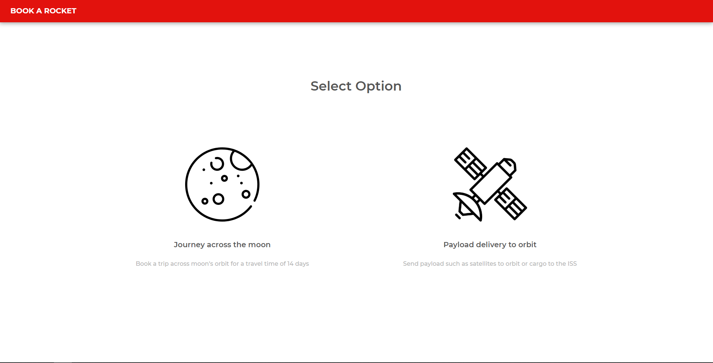
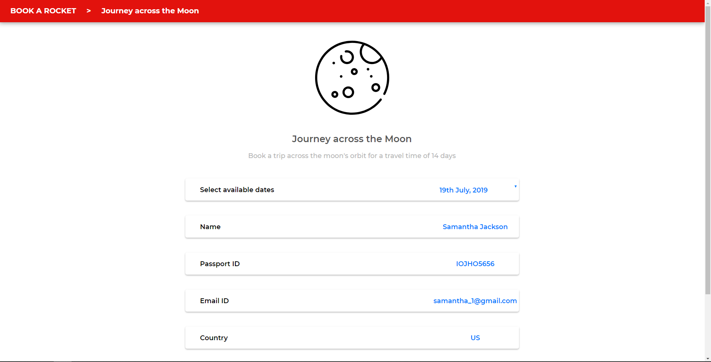
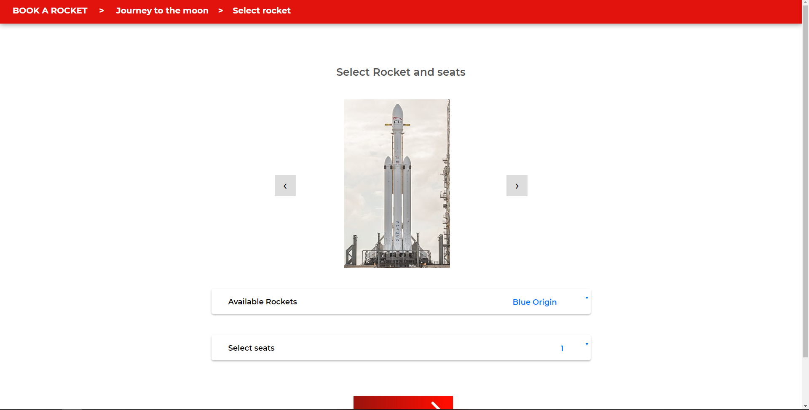
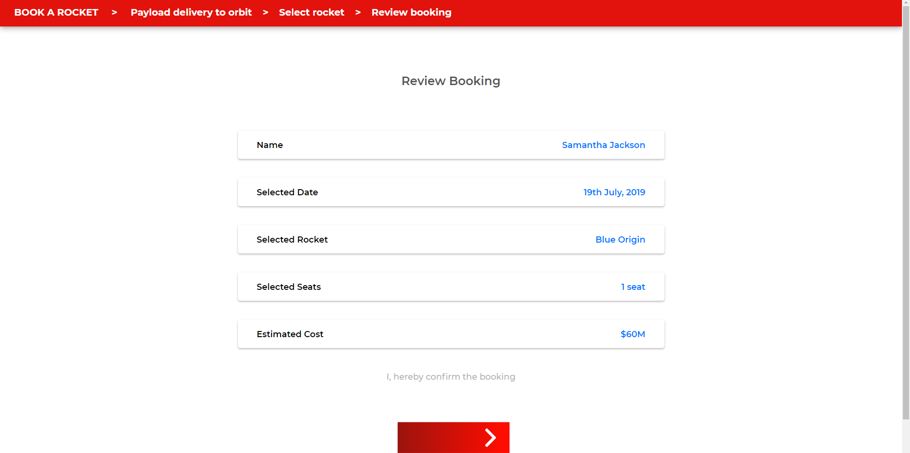
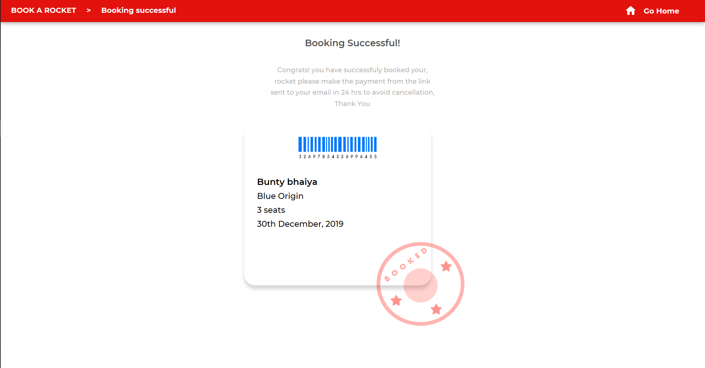

# Rocket-Booking
A simple website with Mysql database to demonstrate a rocket booking system.

The main purpose of this project is to demonsrate a simple and consistent design style established across all the webpages.
The design is unique, minimal and bold.

To access the page, import the sql, move the rocket folder to xampp/htdocs and visit - www.localhost/rocket/landingPage.html

## HomePage

## Options Page

## Moon Form

## Select Rocket

## Review Booking

## Ticked Booked

